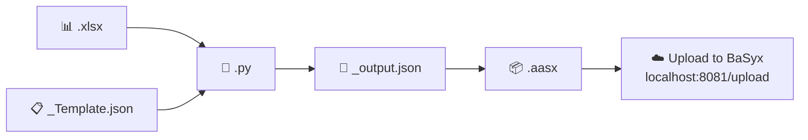

<div align="center">

# 🛠️ aas-digital-twin-Afriso

### Digital twins for Afriso industrial products, powered by Eclipse BaSyx
### 🔁 A reusable pipeline — one guide, any product


</div>

---

This project builds and manages **Asset Administration Shells (AAS)** — standardized digital twins — for Afriso industrial products. It's designed as a reusable template: swap in a new product's Excel data and JSON template, and the same pipeline and infrastructure will generate and publish its AAS package.

> Throughout this guide, `<PRODUCT_ID>` is a placeholder for your product's identifier (e.g. `LAG14ER`, `PrimoVent77766`, etc.) — replace it with the actual `id_short` of the product you're working with.

It combines:
- 🧩 A **BaSyx-based AAS infrastructure** (repositories, registries, discovery, and a web UI) running in containers.
- 🐍 A **Python conversion pipeline** that reads product data from an Excel sheet, fills in an AAS JSON template, packages it as an `.aasx` file, and uploads it to the running AAS environment.

<br>

## 📑 Table of Contents

1. [What this project does](#1-what-this-project-does)
2. [Prerequisites](#2-prerequisites)
3. [Install Podman](#3-install-podman)
4. [Set up the Python environment](#4-set-up-the-python-environment)
5. [Configure environment variables](#5-configure-environment-variables)
6. [Expected project structure](#6-expected-project-structure)
7. [Running the project](#7-running-the-project)
8. [Troubleshooting](#8-troubleshooting)

---

## 1. What this project does

### 🪪 Asset Administration Shell (AAS)
- **id_short**: `<PRODUCT_ID>` — the product's unique short identifier (e.g. `LAG14ER`).
- **id**: `https://www.afriso.com/aas/<PRODUCT_ID>` — globally unique URI, also usable directly as an API endpoint (HTTP GET) on the Afriso AAS registry server.
- **display_name**: Multi-language name (`en`, `de`).
- **description**: Product designation, typically in German and English.
- **asset_kind**: `AssetKind.TYPE`
- **global_asset_id**: Link to the Afriso product details page.
- **administration**: AAS metadata versioning, initialized at `1.0`.
- **Submodel references** (typical set — adjust per product):
  - 🏷️ `Digital Nameplate`
  - 📄 `Handover Documentation`
  - ⚙️ `Technical Data`
  - 🌱 `Carbon Footprint`
  - 🔧 `Maintenance Instructions`

### 🔄 Data pipeline (`<PRODUCT_ID>.py`)



1. Reads product data from an Excel workbook (`../xlsx/<PRODUCT_ID>.xlsx`), matching rows by `Element Name (idShort)` / `Actual Value`.
2. Loads the empty AAS template (`../json_template/<PRODUCT_ID>_Template.json`).
3. Recursively walks the template and injects the Excel values into matching `idShort` fields (handling `Property`, `File`, and `MultiLanguageProperty` elements, including `@de` / `@en` language tags). Fields without matching Excel data are cleared out.
4. Writes the filled JSON to `../output_json/<PRODUCT_ID>_output.json`.
5. Packages the result into an AASX package at `../aasx/<PRODUCT_ID>.aasx` using the `basyx-python-sdk`.
6. Uploads the `.aasx` package to a running BaSyx AAS environment (`http://localhost:8081/upload` by default).

> 💡 **Tip:** re-running the script after updating the Excel sheet regenerates the JSON and AASX package from scratch — no manual cleanup needed.

> 🆕 **Adding a new product:** to onboard a new product, create `<PRODUCT_ID>.xlsx`, `<PRODUCT_ID>_Template.json`, and a `<PRODUCT_ID>.py` (or generalize the script to accept `<PRODUCT_ID>` as an argument) following the same pattern as an existing product.

### 🏗️ Infrastructure (`docker-compose.yml`)
The stack is based on [Eclipse BaSyx](https://www.eclipse.org/basyx/) and consists of:

| Service | Purpose | Port |
|---|---|---|
| 🍃 `mongo` | MongoDB backing store | internal |
| 🏭 `machine1-aas` | AAS environment for machine 1 | `8081` |
| 🏭 `machine2-aas` | AAS environment for machine 2 | `8082` |
| 📇 `aas-registry` | AAS registry (control tower) | `8083` |
| 🔍 `submodel-registry` | Submodel registry / discovery | `8084` |
| 🖥️ `aas-ui` | Web UI for browsing/editing AAS data | `3000` |

---

## 2. 📋 Prerequisites

- 🐧 A Linux, macOS, or WSL2 environment
- 🦭 [Podman](https://podman.io/) (used here instead of Docker, but the `docker compose` CLI syntax is kept via `podman-compose`)
- 🐍 Python 3.9+
- 🔨 `make`

---

## 3. 🦭 Install Podman

### Debian / Ubuntu
```bash
sudo apt update
sudo apt install -y podman podman-compose
```

### Fedora / RHEL / CentOS
```bash
sudo dnf install -y podman podman-compose
```

### macOS (via Homebrew)
```bash
brew install podman podman-compose
podman machine init
podman machine start
```

### Verify installation
```bash
podman --version
podman-compose --version
```

### Make `docker compose` commands work with Podman
The `Makefile` in this project calls `docker compose` directly. The simplest way to make that work with Podman is to alias Docker's CLI to Podman:

```bash
sudo apt install -y podman-docker   # Debian/Ubuntu: provides a `docker` shim for `podman`
```

Alternatively, edit the `Makefile` and replace `docker compose` with `podman-compose` (or `podman compose`, available in recent Podman versions).

> **Note:** the `Makefile` includes a reminder comment (`# need to change podman version`) — double-check the BaSyx image tags in `docker-compose.yml` are compatible with your Podman/Compose version before running `make up`.

---

## 4. 🐍 Set up the Python environment

From the project root:

```bash
# Create a virtual environment
python3 -m venv .venv

# Activate it
source .venv/bin/activate        # Linux/macOS
# .venv\Scripts\activate         # Windows

# Upgrade pip
pip install --upgrade pip
```

### Install dependencies

```bash
pip install pandas openpyxl basyx-python-sdk requests
```

| Package | Purpose |
|---|---|
| `pandas` | Reads and processes the Excel source data |
| `openpyxl` | Excel (`.xlsx`) engine used by `pandas` |
| `basyx-python-sdk` | Reads/writes AAS JSON and builds `.aasx` packages |
| `requests` | Uploads the generated `.aasx` file to the AAS environment |

---

## 5. 🔐 Configure environment variables

Create a `.env` file in the project root (used by `docker-compose.yml`):

```bash
DB_USER=your_mongo_username
DB_PASSWORD=your_mongo_password
CORS_ORIGINS=http://localhost:3000
```

---

## 6. 📁 Expected project structure

The Python script expects the following directory layout relative to its own location:

```
project-root/
├── xlsx/
│   └── <PRODUCT_ID>.xlsx          # source product data
├── json_template/
│   └── <PRODUCT_ID>_Template.json # empty AAS template
├── output_json/
│   └── <PRODUCT_ID>_output.json   # generated after running the script
├── aasx/
│   └── <PRODUCT_ID>.aasx          # generated AASX package
├── scripts/                  # or wherever <PRODUCT_ID>.py lives
│   └── <PRODUCT_ID>.py
├── docker-compose.yml
├── Makefile
└── .env
```

Create any missing folders before running the script:

```bash
mkdir -p xlsx json_template output_json aasx
```

---

## 7. 🚀 Running the project

### ▶️ Start the infrastructure
```bash
make up
```
This creates the required local data/config folders and starts all containers (`mongo`, `machine1-aas`, `machine2-aas`, `aas-registry`, `submodel-registry`, `aas-ui`).

Check logs:
```bash
make logs
```

Once running, the web UI is available at **[http://localhost:3000](http://localhost:3000)** 🎉

### 📤 Generate and upload the AAS package
With the virtual environment activated and the containers running:
```bash
python <PRODUCT_ID>.py
```
*(Replace `<PRODUCT_ID>` with your product's script, e.g. `python LAG14ER.py`.)*

This reads `xlsx/<PRODUCT_ID>.xlsx`, fills the AAS template, writes `output_json/<PRODUCT_ID>_output.json`, builds `aasx/<PRODUCT_ID>.aasx`, and uploads it to `http://localhost:8081/upload` (the `machine1-aas` service).

### 🧹 Stop / clean up
```bash
make down     # stop containers
make clean    # stop containers and remove volumes
make fclean   # full clean: remove images, volumes, and local mongo data
```

---

## 8. 🆘 Troubleshooting

| Problem | Fix |
|---|---|
| ❌ **Upload fails / connection refused** | Make sure `make up` has finished starting `machine1-aas` (check `make logs`) before running `<PRODUCT_ID>.py`. |
| ❌ **Excel columns not found** | The script expects a header row at Excel row 5 (`header=4`) with columns named `Element Name (idShort)` and `Actual Value`. |
| ❌ **Podman + `docker compose` mismatch** | If `make up` fails with a "command not found" error, install `podman-docker` or edit the `Makefile` to call `podman-compose` instead of `docker compose`. |

<div align="center">

---
Made for the Afriso digital twin initiative 🔧

</div>
